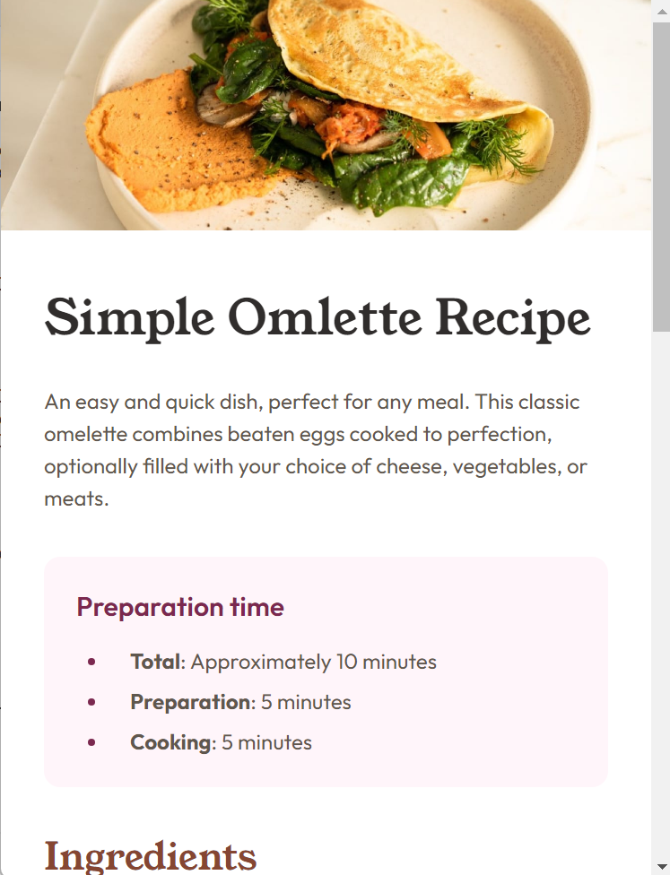
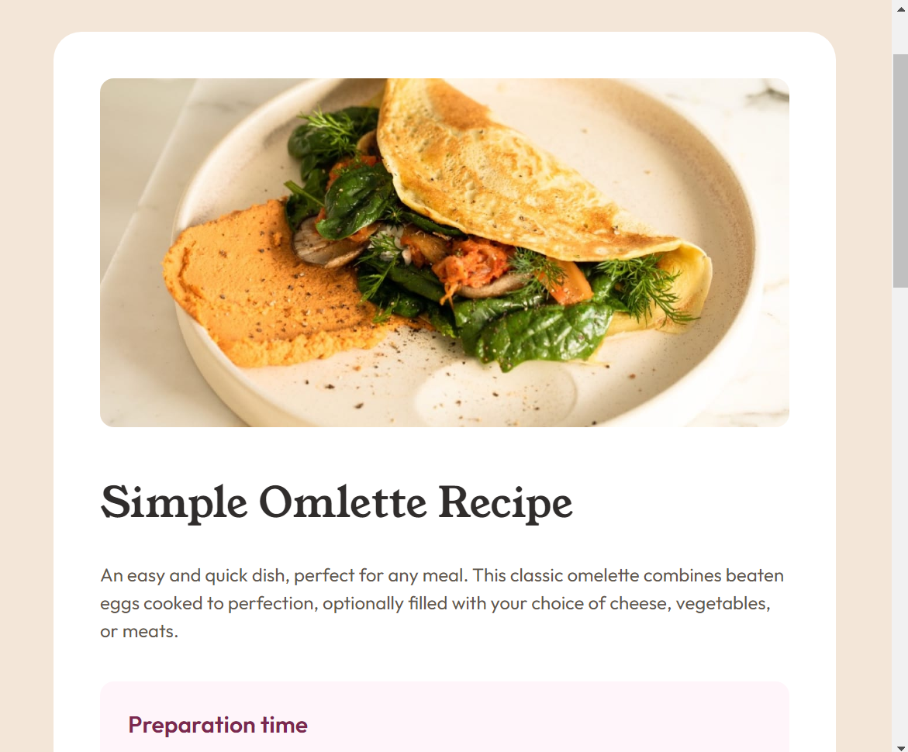
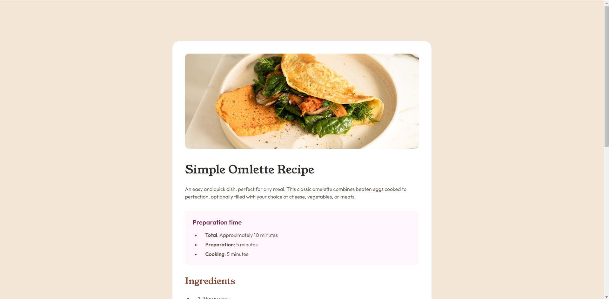

# Frontend Mentor - Recipe page solution

This is a solution to the [Recipe page challenge on Frontend Mentor](https://www.frontendmentor.io/challenges/recipe-page-KiTsR8QQKm).

## Table of contents

- [Overview](#overview)
  - [The challenge](#the-challenge)
  - [Screenshot](#screenshot)
  - [Links](#links)
- [My process](#my-process)
  - [Built with](#built-with)
  - [What I learned](#what-i-learned)
  - [Continued development](#continued-development)
  - [Useful resources](#useful-resources)
- [Author](#author)

## Overview

A single page recipe website with responsive layout

### The challenge

- Focus on writing semantic HTML
- Ensure use of the most appropriate HTML element for each piece of content

### Screenshot





### Links

- Live Site URL: (https://veena-k-venugopal.github.io/fm-recipe-page/)

## My process

I started with organizing the content in HTML semantically. For styling, I started with the basic mobile layout design. Once I was satisfied with the styling of each element in that layout, I moved to the tablet and desktop layouts using media queries at respective breakpoints.

### Built with

- Semantic HTML5 markup
- CSS custom properties
- Flexbox
- Mobile-first workflow

### What I learned

To remove the awkward line break on a bottom-border between 2 columns, use border-collapse property :

```css
table {
  border-collapse: collapse;
  width: 100%;
}
```

### Continued development

The main element that I struggled with styling was the image element. I want to keep practicing that in future projects too.

### Useful resources

- [CSS Breakpoints](https://testsigma.com/blog/css-breakpoints/) - This article provides a detailed look into the different CSS breakpoints for improved responsive design.

## Author

- Frontend Mentor - [Veena-K-Venugopal](https://www.frontendmentor.io/profile/Veena-K-Venugopal)
